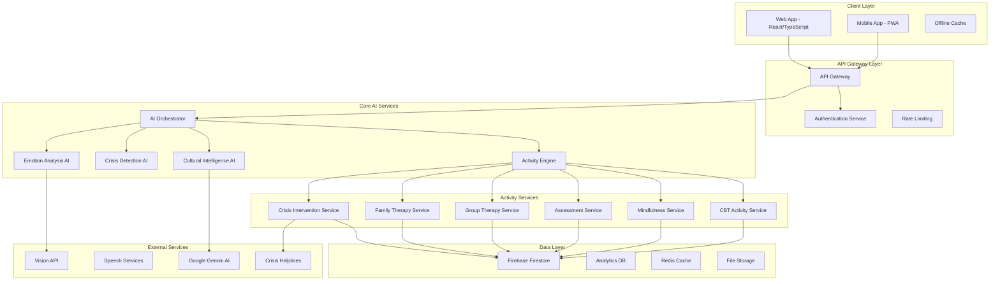

# Design Document

## Overview

This design document outlines the technical architecture for transforming Mann-Mitra into a funding-ready prototype focused on AI-based therapy through diverse, culturally-aware therapeutic activities. The platform will serve as a comprehensive AI therapeutic activity engine that delivers personalized mental health support to Indian youth through engaging, interactive experiences.

The system leverages advanced AI orchestration, real-time emotional analysis, and cultural intelligence to provide therapeutic interventions through activities rather than traditional chat-based interactions. This approach creates a more engaging, effective, and scalable mental health solution specifically designed for the Indian market.

## Architecture

### High-Level System Architecture



### Core Components Architecture

#### 1. AI Orchestrator (Enhanced)
The central intelligence that coordinates all therapeutic activities and AI services.

**Key Responsibilities:**
- Activity selection and personalization
- Cultural context integration
- Real-time adaptation based on user responses
- Crisis detection and intervention
- Progress tracking across activities

**Technical Implementation:**
```typescript
interface AIOrchestrator {
  selectOptimalActivity(userContext: UserContext, sessionHistory: SessionData[]): Promise<ActivityRecommendation>
  adaptActivityInRealTime(activityId: string, userResponse: UserResponse): Promise<ActivityAdaptation>
  assessCulturalContext(userProfile: UserProfile): CulturalContext
  detectCrisisIndicators(userInput: string, emotionalState: EmotionData): CrisisAssessment
  generateTherapeuticInsights(activityResults: ActivityResult[]): TherapeuticInsights
}
```

#### 2. Activity Engine (New Core Component)
Manages all therapeutic activities and their execution.

**Activity Types:**
- **Guided Conversations**: AI-led therapeutic dialogues
- **CBT Exercises**: Interactive cognitive behavioral therapy modules
- **Mindfulness Sessions**: Guided meditation and breathing exercises
- **Assessment Activities**: Conversational mental health evaluations
- **Group Therapy**: AI-facilitated peer support sessions
- **Family Integration**: Activities involving family members
- **Crisis Intervention**: Emergency support activities
- **Cultural Therapy**: Activities incorporating Indian cultural elements

**Technical Implementation:**
```typescript
interface ActivityEngine {
  initializeActivity(type: ActivityType, userContext: UserContext): Promise<ActivitySession>
  executeActivityStep(sessionId: string, userInput: UserInput): Promise<ActivityResponse>
  adaptActivityFlow(sessionId: string, adaptationTrigger: AdaptationTrigger): Promise<void>
  completeActivity(sessionId: string): Promise<ActivityResult>
  generateFollowUpActivities(result: ActivityResult): Promise<ActivityRecommendation[]>
}
```

#### 3. Cultural Intelligence AI (Enhanced)
Provides cultural context and adaptation for all activities.

**Features:**
- Indian cultural norm understanding
- Family dynamics consideration
- Regional language support
- Cultural therapy techniques
- Culturally-appropriate coping strategies

## Components and Interfaces

### Frontend Components (React/TypeScript)

#### 1. Activity Dashboard
```typescript
interface ActivityDashboard {
  // Displays available activities based on user's current needs
  availableActivities: ActivityCard[]
  currentProgress: ProgressIndicator
  recommendedNext: ActivityRecommendation[]
  culturalPreferences: CulturalSettings
}
```

#### 2. Activity Session Interface
```typescript
interface ActivitySessionInterface {
  // Handles real-time activity execution
  currentActivity: ActivitySession
  aiResponse: AIResponse
  userInputHandler: InputHandler
  progressTracker: ProgressTracker
  adaptationEngine: AdaptationEngine
}
```

#### 3. Multi-Modal Input System
```typescript
interface MultiModalInput {
  textInput: TextInputHandler
  voiceInput: VoiceInputHandler
  emotionDetection: EmotionDetectionHandler
  gestureInput: GestureInputHandler
}
```

### Backend Services Architecture

#### 1. Activity Service Layer
```typescript
// Base Activity Service
abstract class BaseActivityService {
  abstract initializeActivity(context: UserContext): Promise<ActivitySession>
  abstract processUserInput(input: UserInput): Promise<ActivityResponse>
  abstract adaptActivity(trigger: AdaptationTrigger): Promise<void>
  abstract completeActivity(): Promise<ActivityResult>
  
  // Common methods
  protected validateInput(input: UserInput): boolean
  protected logInteraction(interaction: Interaction): void
  protected assessProgress(responses: UserResponse[]): ProgressAssessment
}

// Specific Activity Services
class CBTActivityService extends BaseActivityService {
  // CBT-specific implementation
  async conductThoughtChallenge(thought: string): Promise<CBTResponse>
  async guideBehaviorExperiment(goal: string): Promise<ExperimentPlan>
}

class MindfulnessActivityService extends BaseActivityService {
  // Mindfulness-specific implementation
  async guideBreathingExercise(duration: number): Promise<MindfulnessSession>
  async facilitateBodyScan(): Promise<BodyScanSession>
}
```

#### 2. Cultural Intelligence Service
```typescript
interface CulturalIntelligenceService {
  analyzeCulturalContext(userProfile: UserProfile): Promise<CulturalContext>
  adaptContentForCulture(content: string, culture: CulturalContext): Promise<string>
  validateCulturalSensitivity(response: string): Promise<ValidationResult>
  generateCulturallyAppropriateActivities(context: UserContext): Promise<Activity[]>
}
```

#### 3. Real-Time Adaptation Engine
```typescript
interface AdaptationEngine {
  monitorUserEngagement(session: ActivitySession): Promise<EngagementMetrics>
  detectEmotionalChanges(emotionData: EmotionData[]): Promise<EmotionalTrend>
  adaptActivityDifficulty(currentLevel: number, performance: PerformanceData): Promise<number>
  triggerInterventions(triggers: InterventionTrigger[]): Promise<Intervention[]>
}
```

## Data Models

### Core Data Models

#### 1. User Profile (Enhanced)
```typescript
interface EnhancedUserProfile {
  // Basic Information
  uid: string
  email: string
  displayName: string
  age: number
  location: string
  
  // Cultural Context
  culturalBackground: CulturalProfile
  languagePreferences: LanguagePreferences
  familyStructure: FamilyStructure
  
  // Therapeutic Profile
  therapeuticGoals: TherapeuticGoal[]
  preferredActivityTypes: ActivityType[]
  currentRiskLevel: RiskLevel
  therapeuticAlliance: number // 1-10 scale
  
  // Activity Preferences
  activityPreferences: {
    sessionDuration: number // minutes
    difficultyLevel: 'beginner' | 'intermediate' | 'advanced'
    interactionStyle: 'conversational' | 'structured' | 'guided'
    multimodalPreferences: MultimodalPreferences
  }
  
  // Progress Tracking
  overallProgress: ProgressMetrics
  activityHistory: ActivityHistoryEntry[]
  milestones: Milestone[]
}
```

#### 2. Activity Session Data
```typescript
interface ActivitySession {
  sessionId: string
  userId: string
  activityType: ActivityType
  activitySubtype: string
  
  // Session Configuration
  configuration: ActivityConfiguration
  culturalAdaptations: CulturalAdaptation[]
  personalizations: Personalization[]
  
  // Session State
  currentStep: number
  totalSteps: number
  sessionState: 'active' | 'paused' | 'completed' | 'abandoned'
  
  // Interaction Data
  interactions: ActivityInteraction[]
  userResponses: UserResponse[]
  aiResponses: AIResponse[]
  
  // Real-time Metrics
  engagementLevel: number // 1-10
  emotionalJourney: EmotionDataPoint[]
  adaptations: ActivityAdaptation[]
  
  // Outcomes
  sessionResult?: ActivityResult
  insights?: TherapeuticInsight[]
  followUpRecommendations?: ActivityRecommendation[]
}
```

#### 3. Cultural Context Model
```typescript
interface CulturalContext {
  primaryCulture: 'north_indian' | 'south_indian' | 'east_indian' | 'west_indian' | 'mixed'
  subCultures: string[]
  languages: LanguageProfile[]
  
  // Family Dynamics
  familyStructure: 'nuclear' | 'joint' | 'extended' | 'single_parent'
  familyRoles: FamilyRole[]
  familyExpectations: Expectation[]
  
  // Social Context
  educationalBackground: EducationalContext
  socioeconomicStatus: SocioeconomicContext
  religiousBackground?: ReligiousContext
  
  // Cultural Adaptations
  communicationStyle: CommunicationStyle
  conflictResolutionStyle: ConflictStyle
  emotionalExpressionNorms: EmotionalNorms
}
```

#### 4. Activity Result Model
```typescript
interface ActivityResult {
  sessionId: string
  activityType: ActivityType
  completionStatus: 'completed' | 'partially_completed' | 'abandoned'
  
  // Performance Metrics
  engagementScore: number // 1-10
  comprehensionScore: number // 1-10
  emotionalProgress: EmotionalProgressMetrics
  skillDemonstration: SkillAssessment[]
  
  // Therapeutic Outcomes
  therapeuticGoalsAddressed: string[]
  insightsGained: TherapeuticInsight[]
  skillsPracticed: Skill[]
  copingStrategiesLearned: CopingStrategy[]
  
  // AI Analysis
  aiAssessment: AIAssessment
  recommendedFollowUp: ActivityRecommendation[]
  riskAssessment: RiskAssessment
  
  // Cultural Effectiveness
  culturalRelevance: number // 1-10
  culturalAdaptationEffectiveness: number // 1-10
}
```

### Activity-Specific Data Models

#### 1. CBT Activity Data
```typescript
interface CBTActivityData {
  thoughtRecords: ThoughtRecord[]
  behaviorExperiments: BehaviorExperiment[]
  cognitiveDistortions: CognitiveDistortion[]
  challengedThoughts: ChallengedThought[]
  behaviorChanges: BehaviorChange[]
}
```

#### 2. Mindfulness Activity Data
```typescript
interface MindfulnessActivityData {
  breathingExercises: BreathingExercise[]
  bodyScans: BodyScanSession[]
  mindfulnessMinutes: number
  attentionSpanProgress: AttentionMetrics[]
  stressReductionMetrics: StressMetrics[]
}
```

#### 3. Group Activity Data
```typescript
interface GroupActivityData {
  groupId: string
  participants: ParticipantProfile[]
  groupDynamics: GroupDynamicsAssessment
  sharedExperiences: SharedExperience[]
  peerSupport: PeerSupportMetrics
  groupProgress: GroupProgressMetrics
}
```

## Error Handling

### Comprehensive Error Handling Strategy

#### 1. Activity-Level Error Handling
```typescript
class ActivityErrorHandler {
  // Handle AI service failures
  async handleAIServiceError(error: AIServiceError): Promise<FallbackResponse> {
    switch (error.type) {
      case 'api_timeout':
        return this.provideCachedResponse()
      case 'rate_limit':
        return this.scheduleRetryWithBackoff()
      case 'service_unavailable':
        return this.switchToOfflineMode()
      default:
        return this.provideGenericSupportResponse()
    }
  }
  
  // Handle user input errors
  async handleUserInputError(error: InputError): Promise<InputGuidance> {
    return {
      errorType: error.type,
      guidance: this.generateInputGuidance(error),
      suggestedActions: this.getSuggestedActions(error),
      fallbackOptions: this.getFallbackOptions()
    }
  }
  
  // Handle cultural adaptation errors
  async handleCulturalAdaptationError(error: CulturalError): Promise<CulturalFallback> {
    return {
      fallbackCulture: 'generic_indian',
      adaptationStrategy: 'conservative',
      userNotification: this.generateCulturalErrorMessage(error)
    }
  }
}
```

#### 2. Crisis Situation Error Handling
```typescript
class CrisisErrorHandler {
  // Ensure crisis support never fails
  async handleCrisisServiceError(error: CrisisServiceError): Promise<CrisisResponse> {
    // Multiple fallback layers for crisis situations
    const fallbackStrategies = [
      () => this.connectToBackupCrisisService(),
      () => this.provideLocalCrisisResources(),
      () => this.activateEmergencyProtocols(),
      () => this.notifyEmergencyContacts()
    ]
    
    for (const strategy of fallbackStrategies) {
      try {
        return await strategy()
      } catch (strategyError) {
        console.error('Crisis fallback strategy failed:', strategyError)
        continue
      }
    }
    
    // Final fallback - never let crisis support completely fail
    return this.getHardcodedCrisisResources()
  }
}
```

#### 3. Offline Error Handling
```typescript
class OfflineErrorHandler {
  // Handle offline scenarios gracefully
  async handleOfflineScenario(): Promise<OfflineCapabilities> {
    return {
      availableActivities: this.getCachedActivities(),
      offlineAIResponses: this.getPrecomputedResponses(),
      emergencyResources: this.getOfflineCrisisResources(),
      syncStrategy: this.planDataSynchronization()
    }
  }
}
```

## Testing Strategy

### Comprehensive Testing Approach

#### 1. AI Activity Testing
```typescript
describe('AI Activity Engine', () => {
  // Test activity selection algorithms
  test('should select culturally appropriate activities', async () => {
    const userContext = createIndianYouthContext()
    const activity = await activityEngine.selectOptimalActivity(userContext)
    expect(activity.culturalRelevance).toBeGreaterThan(8)
  })
  
  // Test real-time adaptation
  test('should adapt activity based on user engagement', async () => {
    const session = await createActivitySession('cbt_thought_challenge')
    const lowEngagementResponse = createLowEngagementResponse()
    
    await activityEngine.processUserInput(lowEngagementResponse)
    
    const adaptation = await session.getLatestAdaptation()
    expect(adaptation.type).toBe('engagement_boost')
  })
  
  // Test crisis detection during activities
  test('should detect crisis indicators and intervene', async () => {
    const crisisInput = createCrisisInput()
    const response = await activityEngine.processUserInput(crisisInput)
    
    expect(response.interventionTriggered).toBe(true)
    expect(response.interventionType).toBe('crisis_intervention')
  })
})
```

#### 2. Cultural Intelligence Testing
```typescript
describe('Cultural Intelligence', () => {
  // Test cultural adaptation accuracy
  test('should adapt content for different Indian cultures', async () => {
    const northIndianContext = createNorthIndianContext()
    const southIndianContext = createSouthIndianContext()
    
    const northAdaptation = await culturalAI.adaptContent(baseContent, northIndianContext)
    const southAdaptation = await culturalAI.adaptContent(baseContent, southIndianContext)
    
    expect(northAdaptation).not.toEqual(southAdaptation)
    expect(northAdaptation.culturalRelevance).toBeGreaterThan(8)
    expect(southAdaptation.culturalRelevance).toBeGreaterThan(8)
  })
  
  // Test family dynamics integration
  test('should consider family structure in therapy recommendations', async () => {
    const jointFamilyUser = createJointFamilyUserProfile()
    const recommendations = await culturalAI.generateFamilyTherapyActivities(jointFamilyUser)
    
    expect(recommendations.some(r => r.includesFamilyMembers)).toBe(true)
  })
})
```

#### 3. Performance and Scalability Testing
```typescript
describe('Performance Testing', () => {
  // Test concurrent activity sessions
  test('should handle multiple concurrent activity sessions', async () => {
    const concurrentSessions = 100
    const sessionPromises = Array(concurrentSessions).fill(null).map(() => 
      activityEngine.initializeActivity('mindfulness_breathing', createUserContext())
    )
    
    const sessions = await Promise.all(sessionPromises)
    expect(sessions).toHaveLength(concurrentSessions)
    sessions.forEach(session => {
      expect(session.status).toBe('active')
    })
  })
  
  // Test AI response time under load
  test('should maintain response times under load', async () => {
    const startTime = Date.now()
    const responses = await Promise.all(
      Array(50).fill(null).map(() => 
        aiOrchestrator.generateTherapeuticResponse(testInput, userContext)
      )
    )
    const endTime = Date.now()
    
    const averageResponseTime = (endTime - startTime) / responses.length
    expect(averageResponseTime).toBeLessThan(2000) // 2 seconds max
  })
})
```

#### 4. Integration Testing
```typescript
describe('End-to-End Activity Flow', () => {
  test('should complete full therapeutic activity journey', async () => {
    // Initialize user
    const user = await createTestUser()
    
    // Start activity
    const session = await activityEngine.initializeActivity('cbt_anxiety_management', user.context)
    
    // Simulate user interactions
    const interactions = [
      'I feel anxious about my upcoming exams',
      'My family expects me to get into IIT',
      'I worry I will disappoint them'
    ]
    
    for (const input of interactions) {
      const response = await activityEngine.processUserInput(input)
      expect(response.therapeuticValue).toBeGreaterThan(7)
    }
    
    // Complete activity
    const result = await activityEngine.completeActivity(session.id)
    
    expect(result.completionStatus).toBe('completed')
    expect(result.therapeuticGoalsAddressed).toContain('anxiety_management')
    expect(result.recommendedFollowUp).toHaveLength.greaterThan(0)
  })
})
```

#### 5. Accessibility Testing
```typescript
describe('Accessibility Testing', () => {
  test('should support screen readers for all activities', async () => {
    const activity = await activityEngine.initializeActivity('mindfulness_breathing')
    const accessibilityAudit = await auditAccessibility(activity.interface)
    
    expect(accessibilityAudit.screenReaderCompatible).toBe(true)
    expect(accessibilityAudit.keyboardNavigable).toBe(true)
    expect(accessibilityAudit.colorContrastCompliant).toBe(true)
  })
  
  test('should provide voice navigation for all activities', async () => {
    const voiceCommands = ['start activity', 'next step', 'repeat instruction', 'get help']
    
    for (const command of voiceCommands) {
      const response = await voiceNavigationHandler.processCommand(command)
      expect(response.success).toBe(true)
    }
  })
})
```

This comprehensive design provides a robust foundation for building a funding-ready AI therapeutic activity platform that is culturally intelligent, highly engaging, and technically sophisticated. The architecture supports scalability, reliability, and the unique value proposition of activity-based AI therapy for Indian youth.